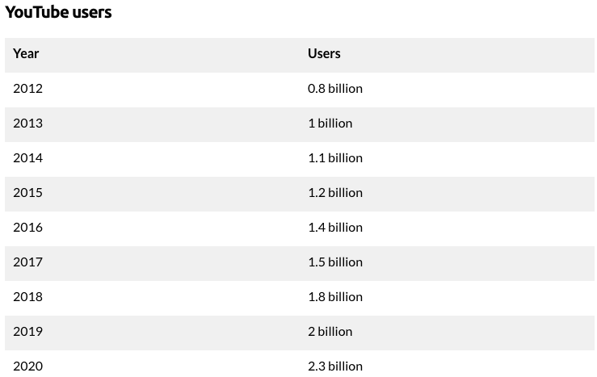
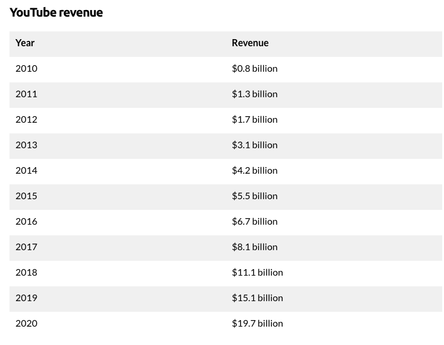
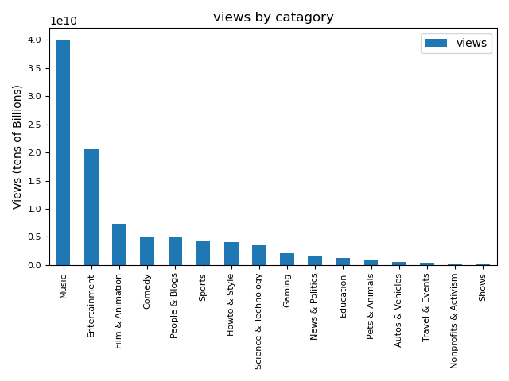
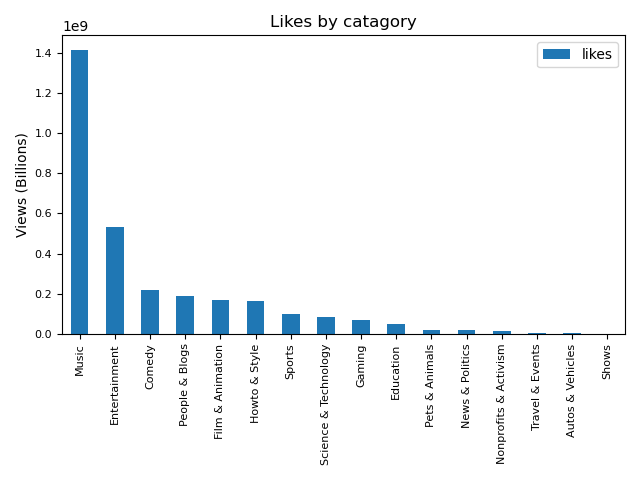
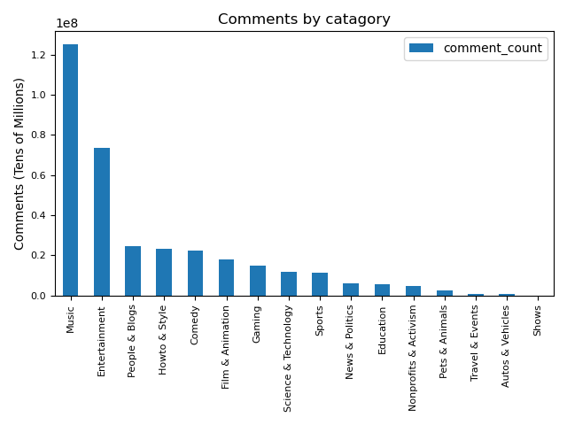
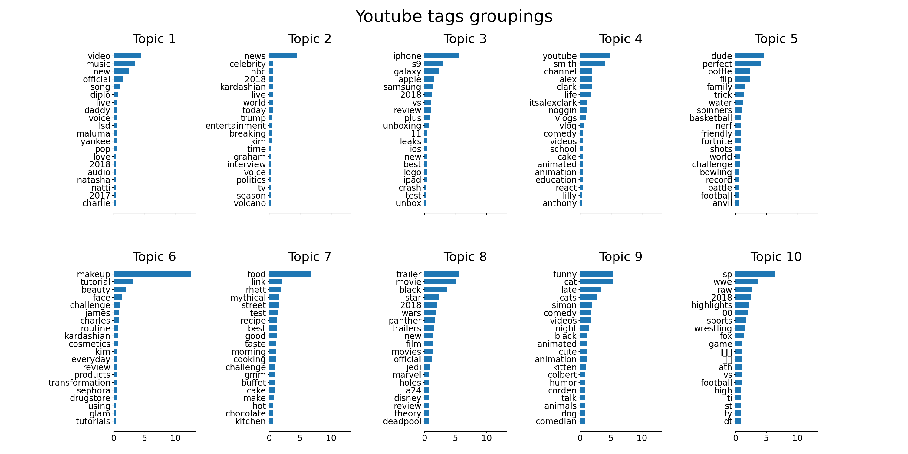
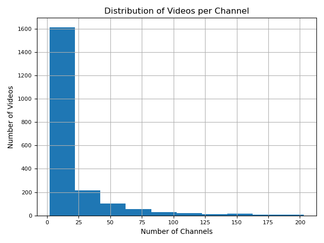
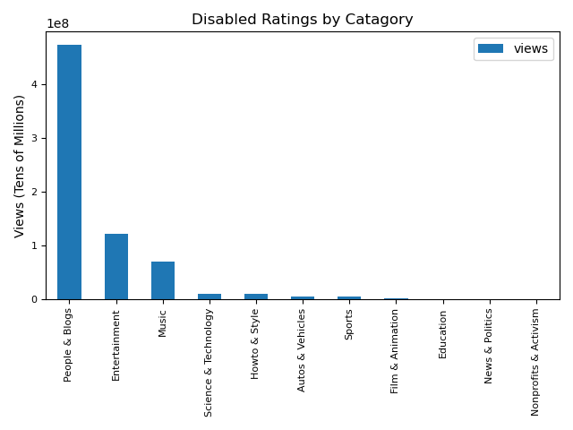
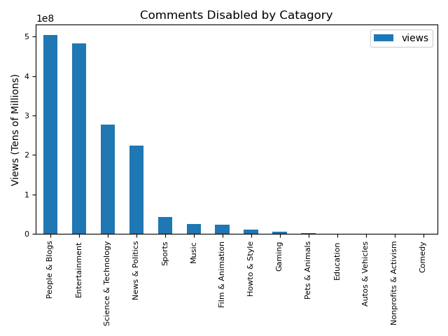

# Youtube background

  
   
  

# Dataset
This dataset is youtube viewship data centered around the videos trending from November 14, 2017-June 14, 2018.

Music catagory is almost 2x the number of views of next closest catagory (Entertainment)
Youtube could be eating Pandora and Spotify's lunch. Perhaps explaining the push towards youtube music.

Again, music dominates the number of likes.  This also could be an indicator of the demographics of youtube viewers. (ie Music centered interests)

Entertainment closes the gap in terms of comments (ie engagement).  Entertainment catagory might be a good source of sentiment analysis of comments for entertainment products

Unsupervised Clustering of tags into 10 topics

Vast majority of youtube channels have less than 25 videos.  Distribution is right skewed indicating some super-users who are super-content creators

People and Blogs is largest catagory with disabled ratings.  Perhaps because of personal content and not wanting public rating of that content

Again, People & Blogs catagory has disproportunate amount of comments disabled possibly due to not wanting Trolling and internet Vitriol

# Sources
https://www.businessofapps.com/data/youtube-statistics/